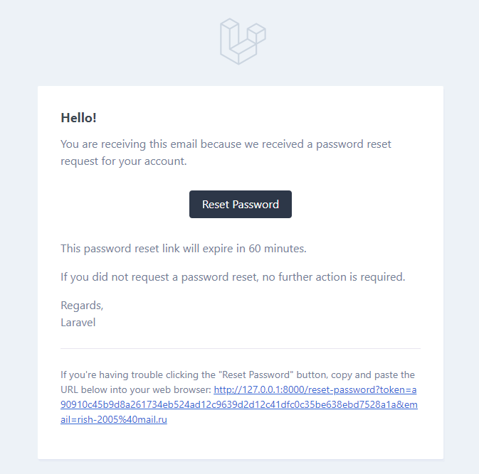
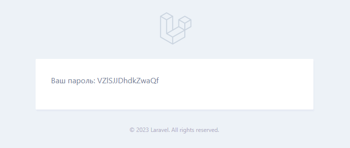

Имеются два зарегистрованных пользователя:
    
    email: rish-2005@bk.ru
    password: 123123123

    email: rish-2005@mail.ru
    password: 123123123

Восстановление пароля тоже происходит через Mailtrap

При регистрации генерируется рандомный пароль, который высылается на почту пользователю

